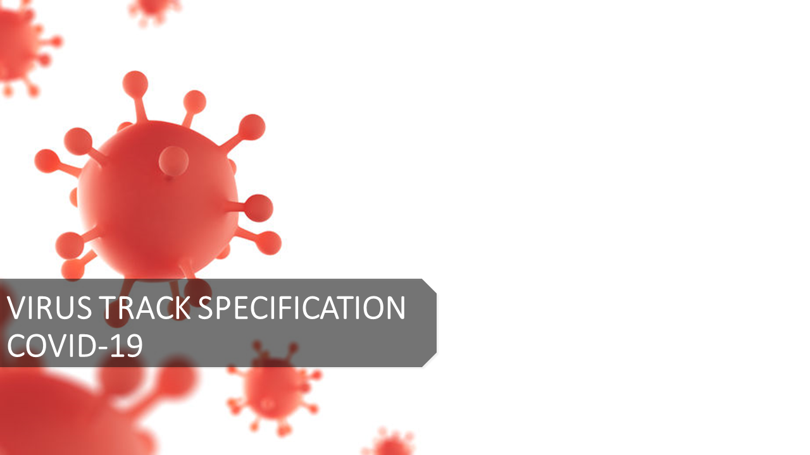
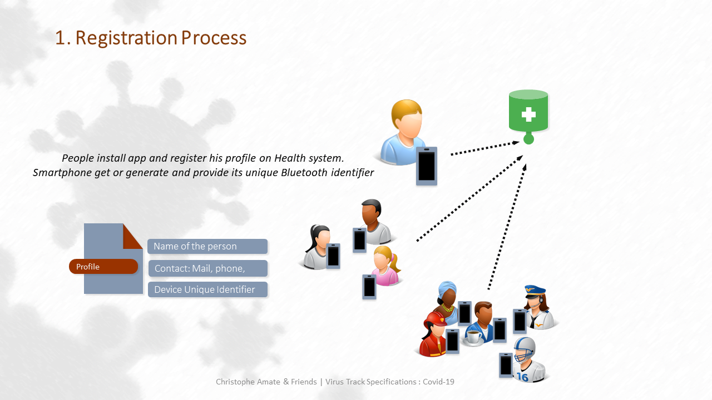
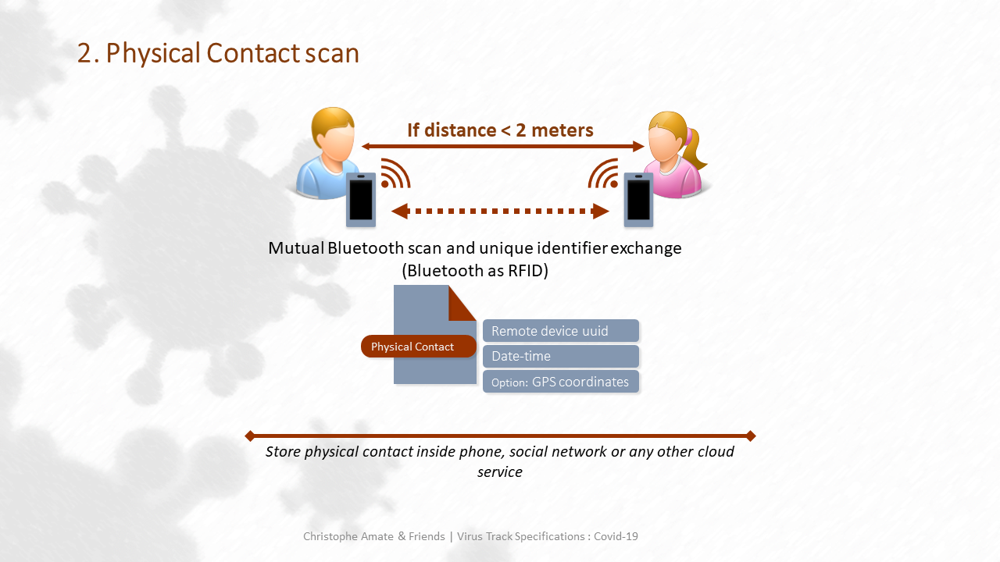
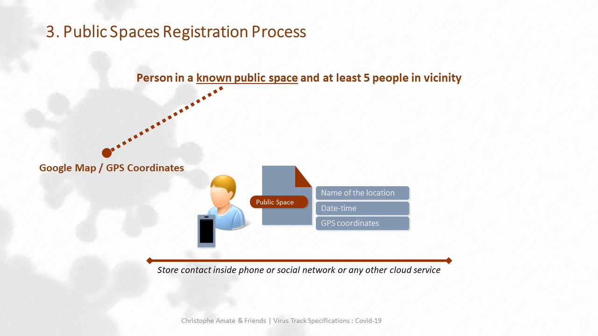
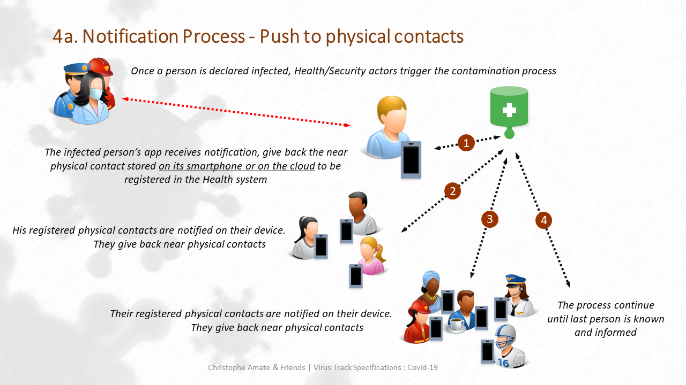
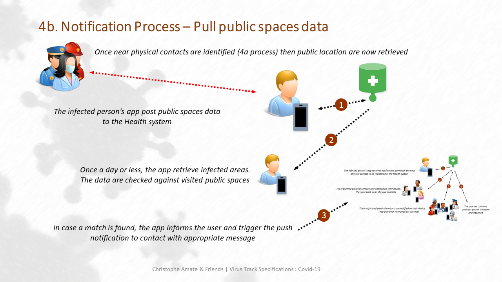
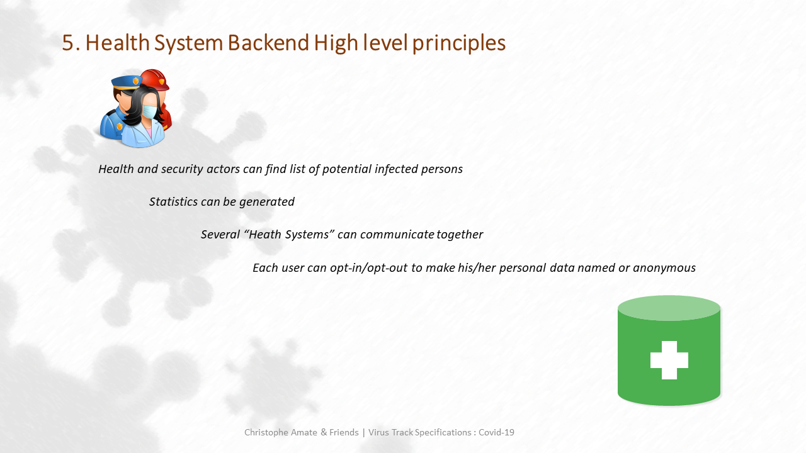

# VIRUS TRACK C19 Specifications

## 1. Registration Process

## 2. Physical Contact scan

[https://reelyactive.github.io/ble-identifier-reference.html](https://reelyactive.github.io/ble-identifier-reference.html)

## 3. Public Spaces Registration Process

## 4a. Notification Process - Push to physical contacts

## 4b. Notification Process – Pull public spaces data

## 5. Health System Backend High level principles

